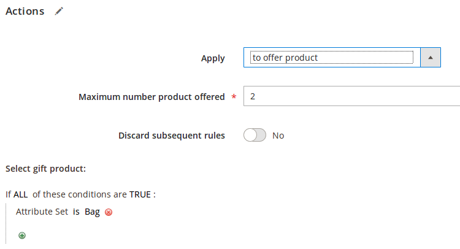
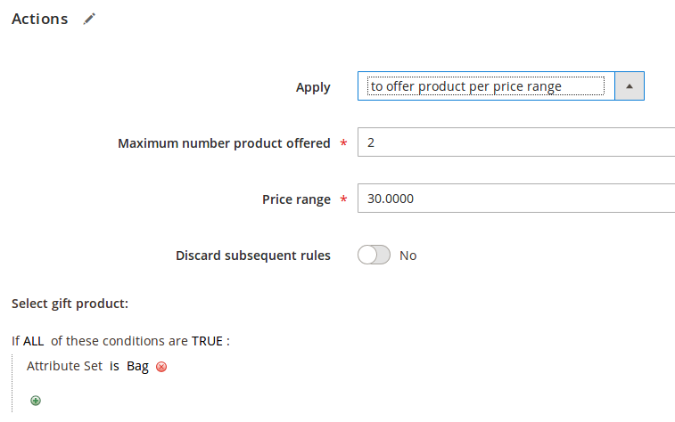
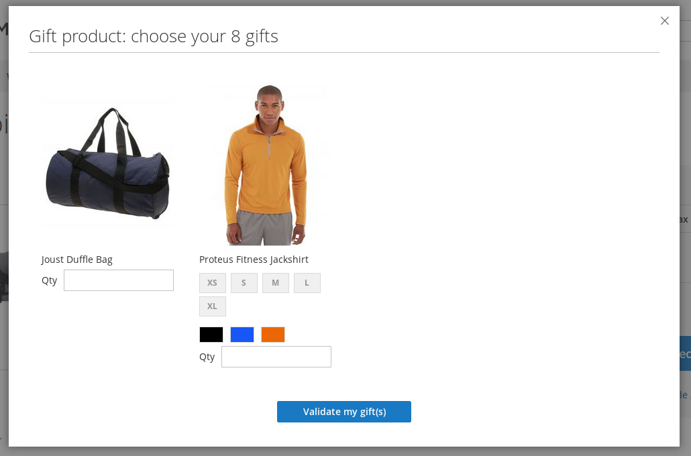
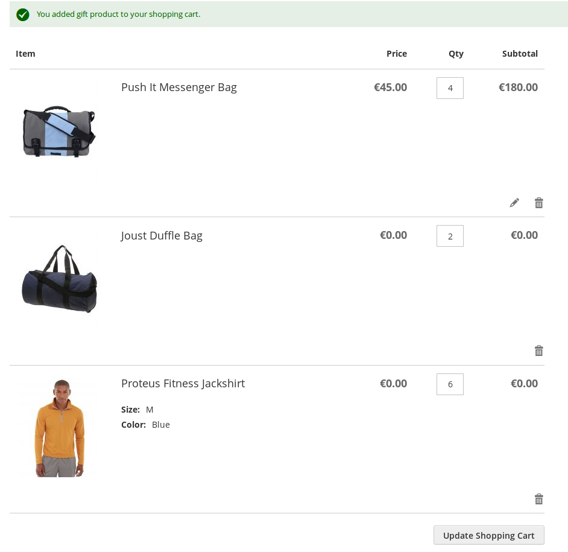

Gift Sales Rule [](https://travis-ci.org/Smile-SA/magento2-module-gift-sales-rule)
=====================================

## What is magento2-module-gift-sales-rule Magento 2 Module?

This module provides 2 new actions to Magento cart price rule feature to :
* offer gift product(s) to customer based on native conditions
* offer gift product(s) to customer each time a threshold is reached (every 30$ in cart for example)

For each cart price rule, administrator can define the number of gift products authorized and use a set of conditions to define the gift product list. 
On the frontend side, when the rule is applied, the customer can choose between a list of products the one(s) he prefers and add them to his cart. 

Gift products type can be:
* simple product
* configurable product

## Magento versions compatibility

**Which version should I use ?**

Magento Version                   | Gift Sales Rule Latest Version                                          | Actively maintained
----------------------------------|----------------------------------------------------------------------|---
Magento **2.3.x** Opensource (CE) | Gift Sales Rule **1.1.x** : ```composer require smile/module-gift-sales-rule ~1.1.0``` | **Yes**
Magento **2.4.x** Opensource (CE) | Gift Sales Rule **1.2.x** : ```composer require smile/module-gift-sales-rule ~1.2.0``` | **Yes**

## Who is developing this module ? 


This module is built by Smile. 

Smile is the **European leader of Open Source** and also a four-times **Europe Partner of the the Year** (2010-2014), two-times **Spirit of Excellence** (2015-2016), **Global Elite Partner** (2017-now), and **Regional Commercial Partner** (2018) awarded by Magento.

Our multidisciplinary team brings together experts in technology, innovation, and new applications.

Together we explore, invent, and test technologies of the future, to better serve our clients.

## Main Features

* **Configure cart price rules to select gift products**


* **Configure cart price rules to select gift products and the price range**


* **Display gift product popin**


* **Display added gift product in cart**


## Documentation

Documentation is available [here](https://github.com/Smile-SA/magento2-module-gift-sales-rule/wiki).

## Standards & Code Quality

Built on top of Magento2, our module respects all its prerequisites and code quality rules.

You can also find our PHPCS Standards and PHPMD rulesets in the module directory.

The module is also continuously tested on :

Tools                           | Results
------------------------------- |------------
Travis                          | [](https://travis-ci.org/Smile-SA/magento2-module-gift-sales-rule)
